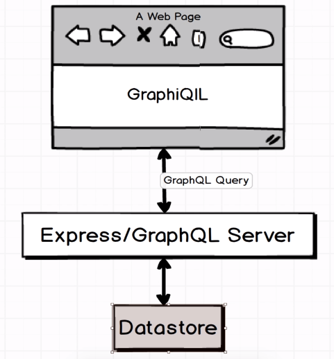
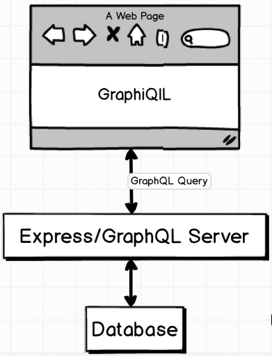
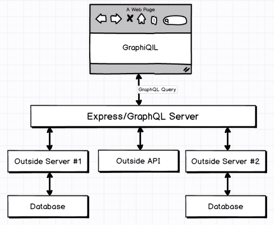

# Working with GraphQL



We will create an **Express** server then hook to a **Datastore** and then load up pre-built GraphiQL to test some test queries.

**GraphiQL**

- solely made for development purposes to help us feel how GraphQL works and how we can execute queries with it
- made by GraphQL team

### GraphQL Schemas

Contains all the knowledge required for telling GraphQL exactly what our application's data looks like, including what properties each object has and exactly how each object is related to each other.

#### A Simple GraphiQL Query

Notice the displayed returned values has a 'user' key. This is because of our **RootQuery** where we define it in line 27(under **fields**).

**HOW THIS WORKS:**

**user** :: look for me a user  
**args**(arguments) :: the field/parameter we need to provide in this object/instance which in any case the **id** of the user.
**type** :: will return the user
**resolve** :: a function where it goes to the database/datastore and find the actual data we are looking for resolve params:  
**parentValue** :: somewhat notorious because it won't be used ever
**args** :: the actual object that gets called with whatever arguments were passed into the original query.
For example, in our **args** parameter, if we declare/assign an **id**, the **id** data will also be present when we display the data in our resolve **args**.

| Parameters | Function |
| **user** | Look for me a user |
| **args** | The field/parameter we need to provide in this object/instance, which in any case is the **id** of the user. |
| **type** | Will return the user |
| **resolve** | A function where it goes to the database/datastore and finds the actual data we are looking for. |
| **parentValue** | Somewhat notorious because it won't be used ever. |
| **args** | The actual object that gets called with whatever arguments were passed into the original query. For example, in our **args** parameter, if we declare/assign an **id**, the **id** data will also be present when we display the data in our resolve **args**.|

```javascript
// See schema.js for full code
...
...

const RootQuery = new GraphQLObjectType({
  name: "RootQueryType",
  fields: {
    user: {
      type: UserType,
      args: {
        id: {type: GraphQLString}
      },
      resolve(parentValue, args){
        return _.find(users, {id:args.id})
      }
    }
  }
})
```

```javascript

// Query
{
  user(id: "23") {
    id
    firstName
  }
}

// Returned Values
{
  "data": {
    "user": {
      "id": "23",
      "firstName": "Bill"
    }
  }
}

```

### Architecture of an Actual Project with GraphQL

#### Simple



Explanation:
We have a browser running a GraphiQIL that sends a GraphQL query to our Express/GraphQL server and in theory we can have a MongoDB database/any db and find and collect the data out from the schema using 'resolve' function(think of it as is similar to 'yield' in Scrapy wherein it will return the data to the user)

#### Big Projects



NOTE:

- GraphQL can serve as proxies of sorts to go and fetch data from all of these different sources, pull all the data together, and ship a response back to our user.
  **We are following this approach when we created 'db.json'**, meaning, we are running a separate server process from our normal GraphQL server.
