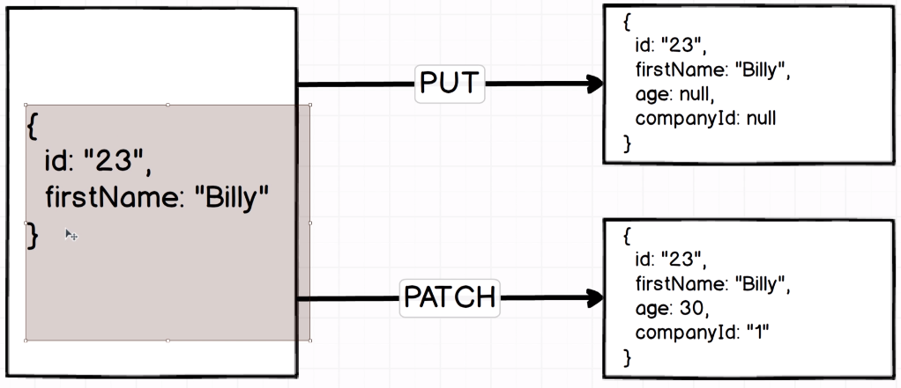
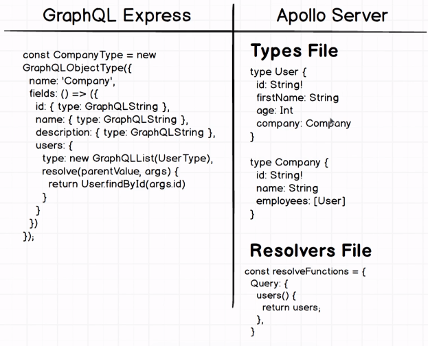

# Working with GraphQL

### Installation

1. We are using express-graphql as a middleware to build a connection between express and graphql
2. At the beginning of this project, lodash will be used as a helper tool to query to our database and collect it. (resolve function will help us return this to our user)

```shell
npm i express express-graphql graphql lodash


```


We will create an **Express** server then hook to a **Datastore** and then load up pre-built GraphiQL to test some test queries.

**GraphiQL**

- solely made for development purposes to help us feel how GraphQL works and how we can execute queries with it
- made by GraphQL team

### GraphQL Schemas

Contains all the knowledge required for telling GraphQL exactly what our application's data looks like, including what properties each object has and exactly how each object is related to each other.

#### A Simple GraphiQL Query

Notice the displayed returned values has a 'user' key. This is because of our **RootQuery** where we define it in line 27(under **fields**).

**HOW THIS WORKS:**

| Parameters      | Function                                                                                                                                                                                                                                                       |
| --------------- | -------------------------------------------------------------------------------------------------------------------------------------------------------------------------------------------------------------------------------------------------------------- |
| **user**        | Look for me a user                                                                                                                                                                                                                                             |
| **args**        | The field/parameter we need to provide in this object/instance, which in any case is the **id** of the user.                                                                                                                                                   |
| **type**        | Will return the user                                                                                                                                                                                                                                           |
| **resolve**     | A function where it goes to the database/datastore and finds the actual data we are looking for.                                                                                                                                                               |
| **parentValue** | Somewhat notorious because it won't be used ever.                                                                                                                                                                                                              |
| **args**        | The actual object that gets called with whatever arguments were passed into the original query. For example, in our **args** parameter, if we declare/assign an **id**, the **id** data will also be present when we display the data in our resolve **args**. |

```javascript
// See schema.js for full code
...
...

const RootQuery = new GraphQLObjectType({
  name: "RootQueryType",
  fields: {
    user: {
      type: UserType,
      args: {
        id: {type: GraphQLString}
      },
      resolve(parentValue, args){
        return _.find(users, {id:args.id})
      }
    }
  }
})
```

```javascript

// Query
{
  user(id: "23") {
    id
    firstName
  }
}

// Returned Values
{
  "data": {
    "user": {
      "id": "23",
      "firstName": "Bill"
    }
  }
}

```

### Architecture of an Actual Project with GraphQL

#### Simple


Explanation:
We have a browser running a GraphiQIL that sends a GraphQL query to our Express/GraphQL server and in theory we can have a MongoDB database/any db and find and collect the data out from the schema using 'resolve' function(think of it as is similar to 'yield' in Scrapy wherein it will return the data to the user)

#### Big Projects


NOTE:

- GraphQL can serve as proxies of sorts to go and fetch data from all of these different sources, pull all the data together, and ship a response back to our user.
  **We are following this approach when we created 'db.json'**, meaning, we are running a separate server process from our normal GraphQL server.

### Async Resolve Functions


- Resolve functions can work by returning a Promise so it can work in Asynchronous

### How our GraphQL query data


1. In our current GraphQL, our query starts at the RootQuery (Update: we added new rootquery to collect data immediately to Company)
2. So, we cannot directly collect data from the Company
3. This is Unidirectional in anture, which we can only operate in a single direction


- Imagine we are working in a graph
- **Resolve** is a function in helping us move from one object type to another by returning a piece of data
- Think of edges in our graph as the **resolve** function

### Query Fragments

- A list of different properties that we want to get access to.
- Why use? because defining repeated text is tiresome to duplicate (For example, we added **id**, **name**, and **description** to apple and google)

Since we can use multiple field from our RootQuery, we can use an **alias** that the returned values are assigned to this name. In this case, we are using **apple** and **google**.

**NOTE:** We do not need to name both of them, as long as they don't have the same IDs

```javascript
// INPUT:
{
  apple: company(id: "1"){
    // id
    // name
    // description
    ...companyDetails
  }

  google: company(id: "2"){
    // id
    // name
    // description
    ...companyDetails
  }
}

// paramters:
// 'companyDetails' is the name of our fragment
// 'Company' a type checking that our object will be collected from Company object(JUST A TYPE CHECKING, SO WE CAN REMOVE THIS BUT ESSENTIALLY IMPORTANT)
fragment companyDetails on Company {
  id
  name
  description
}

// OUTPUT
{
  "data": {
    "apple": {
      "id": "1",
      "name": "Apple",
      "description": "IPhone"
    },
    "google": {
      "id": "2",
      "name": "Google",
      "description": "Search"
    }
  }
}
```

## Introduction to Mutations

Mutations are used to change our data in some fashion. Mutations can be used to delete records, update them, or even create new records.

**We will now add mutation to our schema**


- We will create a separate objects for manipulating data
- CompanyType and UserType won't be affected

```javascript
const mutation = new GraphQLObjectType({
  name: "Mutation",
  fields: {
    addUser: {
      type: UserType,
      args: {
        firstName: {type: new GraphQLNonNull(GraphQLString)},
        age: {type: new GraphQLNonNull(GraphQLInt)},
        companyId: {type: GraphQLString}
      },
      resolve(parentValue, {firstName, age}){
        return axios.post(`http://127.0.0.1:3000/users`, { firstName, age }).then(res => res.data)
      }
    }
  }
})

```

- When we use mutation, it has a different declaration wherein we declare **mutation**
- Even though this is a **post** request, we should always return some data from it. In this case, **id**, **firstName**, and **age**
```javascript
mutation {
  addUser(firstName:"Jonathan", age:30){
    id
    firstName
    age
  }
}
```

## Recalling How PUT vs PATCH Work


#### PUT 
- When we want to completely replace the existing record saved on some other remote database with the details inside of our request body
- (Look at the given example above) For example, in our request body, we defined **id** and **firstName** in an object, it will the **id** and **firstName** in our data including **age** and **companyId** setting to null because these were not defined in our request body object.

### PATCH
- Only overwrites the properties that are contained within the request body
- (Look at the given example above) For example, in our request body (object), we defined **id** and **firstName** in an object, it will only the **id** and **firstName** in our database only.


## GraphQL Express vs Apollo Client
We will be using **express-graphql** which is not part of Apollo stack but there is not Apollo server that we can make use of. Neither is better than the other


#### GraphQL Express
- Reference implementation of GraphQL, sort of spec how our server will be implemented with GraphQL
- Creates a big object and define the fields and resolve functions that travel to each node in our data

#### Apollo Server
- Different way on implementing GraphQL to the server
- Break up to two separation sections: **Types** file and **Resolvers** file

### Understanding parentValue in Resolvers
**parentValue** (also known as source or root in some contexts) is the result of the previous resolver in the chain. It carries the resolved data from the parent object.

**GraphQL Query**
```javascript
{
  user(id:"67"){
    id
    firstName
    company{
      name
    }
  }
}
// parentValue of UserType:
// { id: '67', firstName: 'Jade', age: 15, companyId: '2', userId: '67' }

// args of RootQuery 'user':
// { id: "67" }

// parentValue of RootQuery 'user':
// undefined

```

### See explanation below


**Resolver Chain Explanation**
```javascript
const RootQuery = new GraphQLObjectType({
  name: "RootQueryType",
  fields: {
    user: {
      type: UserType,
      args: {
        id: {type: GraphQLString}
      },
      resolve(parentValue, args){
        console.log("rootQueryUser: ", args);
        return axios.get(`http://127.0.0.1:3000/users/${args.id}`).then(res=> res.data)
        // const { data } = res
        // return data
      }
    },
})  

```
- The user field in the RootQuery is resolved first.
- args contains the query arguments, so args.id is "67".
- The resolver fetches the user with ID "67" from the API.
- The response is an object representing the user, e.g., { id: "67", firstName: "John", companyId: "123" }.
- This user object becomes the parentValue for the next level of resolvers (the fields of UserType).

**UserType Resolver**
```javascript
// GraphQL 
const UserType = new GraphQLObjectType({
  name: 'User',
  fields: ()=> ({
    id: {type: GraphQLString},
    firstName: {type: GraphQLString},
    age: {type: GraphQLInt},
    company: {
      type: CompanyType,
      resolve(parentValue, args){     // Using resolve, we can query to another object
        console.log("user: ",parentValue);
        return axios.get(`http://127.0.0.1:3000/companies/${parentValue.companyId}`).then(res => res.data)
      }
    }
  })
})

```
- For the company field in UserType, the resolver function is called.
- The parentValue here is the user object: { id: "67", firstName: "John", companyId: "123" }.
- The resolver uses parentValue.companyId (which is "123") to fetch the company details from the API.
- The response is an object representing the company, e.g., { id: "123", name: "Google", description: "Tech Company" }.
- This company object becomes the parentValue for the next level of resolvers (the fields of CompanyType).

**ComapnyType Resolver**
```javascript
const CompanyType = new GraphQLObjectType({
  name: 'Company',
  fields: () => ({
    id: {type: GraphQLString},
    name: {type: GraphQLString},
    description: {type: GraphQLString},
    users: {    // teach GraphQL to return list of users from a company
      type: new GraphQLList(UserType),
      resolve(parentValue, args){
        console.log("company: ", parentValue);
        return axios.get(`http://localhost:3000/companies/${parentValue.id}/users`).then(res => res.data)
      }
    }
  })
})

```
- If the query included fields for the company, those fields would now be resolved using the company object.
- For example, if there was a users field in the CompanyType, its resolver would use the company object as parentValue.

In simpler term, for the **UserType** the properties of the **user** are the **parentValue**